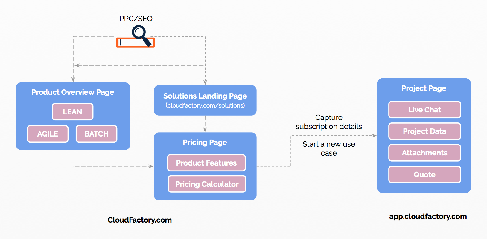
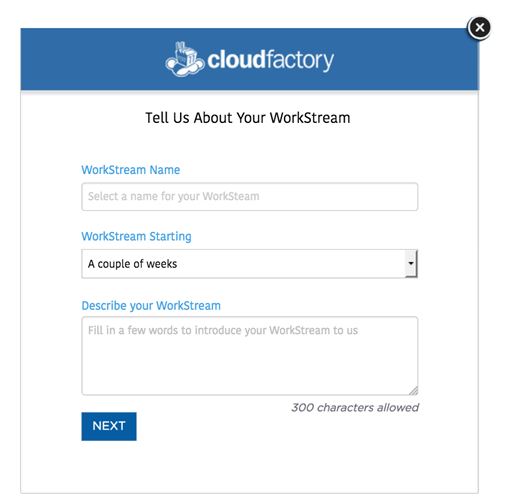
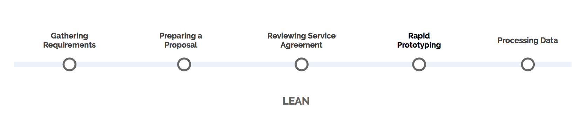
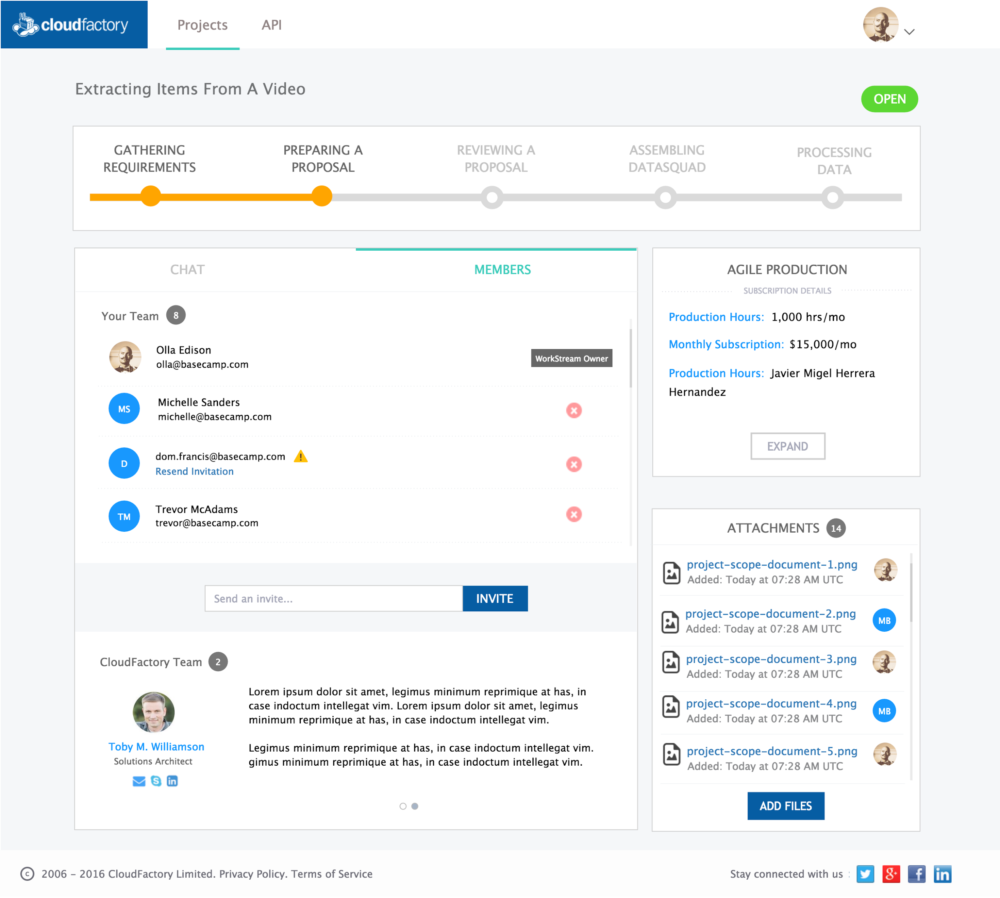

## Customer Segments
Customer segments refers to the different states of a user. The terminologies we’re using here are consistent with how Intercom.io and the CloudFactory application segments user. In the image below, we see a high level view of how a lead transitions to a customer. 

Image: Lead nurturing process
  

**Definition of each segment**

*  **LEAD**: 
A lead is a site visitor. This person is yet to register in the application and therefore we know little about this person. In case, he/she has come in through PPC campaigns, or web search, then we can derive some metadata about this person via the incoming stream.  The Intercom chat widget, in the CloudFactory website, does allow us to capture metadata about a lead if he/she sends a chat message or responds to an outbound message. On either event, the LEAD is registered in Intercom.io and is identified there on out using browser cookies.If the LEAD enters metadata about self, like email address, that is also preserved in Intercom.  So, with Intercom. we can capture some details about a LEAD hence revealing a little bit more about him/her. 

Image: How Intercom bridges cloudfactory.com and app.cloudfactory.com 

 

* **USER or PROSPECT**: A user is a person who has registered to CloudFactory’s client application. If the user chooses to reveal other information then we sync that with Salesforce and Hubspot.

* **CUSTOMER**: A customer is a user who has been successfully on-boarded as a client. The customer has at least one use case currently in production. 

In Intercom.io, a LEAD or a USER can be further classified into further segments. Out-of-the-box Intercom comes with three pre-defined segments which are listed below. Intercom.io also allows us to customize how each segment is defined

* NEW: By default, a NEW user is someone who first Signed Up 1 day ago. LEADS don’t have a Signed

* ACTIVE: An ACTIVE lead or a user is someone who was Last Seen in the last 30 days

* ACTIVE: An ACTIVE lead or a user is someone who was Last Seen in the last 30 days

## Subscription

All WorkStreams are tied to a subscription type - AGILE, LEAN or BATCH. 

There are several channels via which a site visitor can land in the app. There are links to the app from the homepage, product pages, and use case pages. In each of these instances, selection the user had made in the website, like product, project scope, or use case, is carried over to the application.  

For example, let’s say a user is looking under the Agile offering in the CloudFactory website, then selects number of hours in the pricing calculator and clicks on “Get Started”. This directs the user to the app where it takes the details from the website and prompts the user to start a new WorkStream. 

Image: Agile pricing calculator
 

Consider another example where a user is coming from one of the use case pages, and then selects the product, subscription in the website. When the user lands in the app to start a WorkStream, the details of the WorkStream is pre-populated from the use case. Known subscription details from the pricing calculator is entered. 

Subscription details that are either missing are to be entered in the application as they become known

|             |               |            |
:-----------: | :-----------: | :-----------:
|cloudfactory.com             |   | Start a use case using details entered in the sales calculator|
|app.cloudfactory.com         |   | Start an Agile WorkStream, subscription details aren’t populated|

If someone comes to the app directly and starts a new WorkStream, then it is considered an Agile WorkStream by default. For the purpose of clarity, a WorkStream in the app is synonymous to an opportunity in Salesforce. We’ll cover how the app integrates with other ecosystems in a different section below.

A WorkStream’s status may be open (by default) or closed. An open WorkStream means it is active and currently being worked on. A WorkStream that has been closed means the opportunity wasn’t realized. A user is made aware of the status of the WorkStream in the WorkStream page (see image below). An internal team member can not only see the status but also change it as needed. 

A user’s view of the project space is shown below.  

Image: WorkStream administration page
 

From the administration screen, the name of the WorkStream, its description and other attributes can be changed. The WorkStream Starting attribute should be filled in once it is established when the WorkStream is beginning. The Intended Start Date field to the side is basically what the customer filled in while starting the WorkStream. 

## Workstream Attachments
Attachments are files added to the WorkStream. An attachment may be added by the customer to describe the scope of the project, or to send us some sample data[I think we should construct the UX/UI of the app to more strongly encourage users to upload sample data (with guidance on formats that are helpful for us) and provide task instructions as soon as possible. Maybe that's part of the initial automated chat message.][Good idea.
+anuj@cloudfactory.com can we also customize the FileStack dialog to include instructions / links to sample input file CSV, business rules documents?], business rules document, API integration document, or any other artifacts relevant in the Gathering Requirements milestone. Then in the latter milestones, the quote/proposal can be sent to the customer and an attachment. 

So simply put, it is a project artifact. A project member, both from customer’s side and CloudFactory’s side can upload an attachment with the exception of workers.

## Creating a new workstream

To create a new WorkStream, a user only need to provide some baseline attributes. These include the name of the WorkStream, when it’s intended to begin, and a short description for it. We’ve intentionally kept this a lightweight process with the idea that the details of the WorkStream will be made known when we interact with the customer and then filled in. 

Image: Starting a WorkStream
 

## Subscription Attributes

Depending on the subscription type (AGILE, LEAN, BATCH), there’s a unique list of attributes that make up the production details. 

 
|                          |                                                                                                      | 
| :------------------------: | -------------  | 
| **AGILE **     | * **Hours per month**: Estimated monthly production hours required for the project. Typically this is between 200 to 2000 hours per month but may even be greater|
|                |* **Premium hours**: Number of premium hours requested by the client                                  |
|                |* **Billing method**: Either monthly or yearly. Yearly subscription is typically offered with a discount|
|                |* **Monthly subscription fees**: Subscription fees based on the number of hours required monthly
|                |* **Number of data specialists**: Number of data specialists executing on a project. This is provided in range. | 
| **BATCH** | * **Total number of units**: Estimated total size of the project or number of units |
|           |* **Estimated time per unit**: Estimated time required to process one unit|
|           |* **Estimated project price**: Estimated range of the project. This is in dollars
|           |* **Project price**: Final price quoted for the project cost in dollars  | 
|**LEAN**   |* **Package**: Refers to the tier. It is one of Kilofactory, Megafactory, Gigafactory or Terafacory.  
|           |* **Estimated units per month**: Estimated units expected from the user each month. 
|           |* **Estimated time per unit**: Estimated time required to process one unit:
|           |* **Estimated range per unit**: Estimated range to process one unit, provided in cents
|           |* **Fixed price per unit**: Fixed cost to process one unit. This is distilled from the earlier range. It is also provided in cents

## Workstream Milestones

WorkStream milestones are phases that a WorkStream advances through as it is worked on. Each product offering (AGILE, BATCH and LEAN) has it’s own set of milestones. Generally speaking, the milestone for each offering is very similar but with some nuances. 

A new WorkStream that has just started does not have a milestone. It is only after an ISR verifies the validity of the request does he/she upgrade the milestone to **Gathering Requirements.** This is the first milestone. A WorkStream that is successfully on-boarded will peak at the **Processing Data** phase. 

Milestones are sequential in nature. A new WorkStream without any milestones is upgraded only after first touch from sales, during which they’ll validate the use case. Deserving projects henceforth are moved to the **Gathering Requirements step. **

## Milestones for AGILE WorkStream
For AGILE, the milestones advance through the following phases. The first phase, **Gathering Requirement**, is obtained after Sales qualifies the use case. As the name implies, during this phase the objective is to learn more about the client’s use case to better establish the package client needs and derive the Total Cost of Ownership or TCO. 

An estimated TCO is also revealed to a prospect using the pricing calculator in the Cloudfactory website. In the application, we can validate if the selected production hours does indeed meet the client’s need and lock down a price. 

In the second phase, or **Preparing a Proposal**, the objective is to prepare a proposal for the work. In the third phase, or **Reviewing Service Agreement**, is where the proposed terms are reviewed internally and by the prospect. Upon getting the go ahead from both sides, a DataSquad is assembled to execute the project which finally yields into the final step, or **Processing Data.**

Image: AGILE Milestone
 

## Milestones for BATCH WorkStream
The first three milestones in a BATCH project is similar to AGILE. The key difference is, for a BATCH project, we quote a TCO range to the client based on total volume and effort per unit. In the **Gathering Requirements** phase, we seek clarity into the numbers to go from a range to a final TCO.

After step #3, **Reviewing Service Agreement**, the project may advance in one of two directions - one via using an in-house data squad for data processing, or another via using distributed workers. If done in-house, the milestone is changed to **Assembling DataSquad**. Alternatively, if workers are distributed and we use the microtasking workflow to get the work done, the appropriate milestone is **Rapid Prototyping.**  

Image: BATCH Milestones
 

## Milestones for LEAN WorkStream
A LEAN opportunity employs the full stack CloudFactory solutions. Since the work is done via our platform and ‘generally’ using distributed workers, the advancement of the phases happens as follows:

Image: LEAN Milestone
 

** WorkStream Chat**
When a user starts a new WorkStream, they can begin discussing their use case with a CloudFactory agent immediately using the chat section or widget. The goal is to derive WorkStream specific data over an interactive chat medium to qualify the lead and then define subsequent actionables. 

The chat widget is powered in the backend using Intercom.io. 

Users will talk to the CloudFactory team from the application. CloudFactory team can either respond from Team Inbox in Intercom or from the WorkStream page directly. When a new WorkStream is created, an internal message is posted in the chat. This message, which is only visible to the CloudFactory team, contains the “Name”, “Subscription Type”, and “URL” of the project. This message also triggers an email to those subscribed to unassigned conversation in Intercom. You can change your notification settings in Intercom by going to My Settings > Notifications. The notification email looks like below:

Image: Email notification for a new WorkStream
 

Although Team Inbox is Intercom allows you to respond to a conversation, we recommend that you go to the WorkStream page to converse. You can navigate to the project space by copy/pasting the project URL from the notification email. This is because the Intercom widget doesn’t support group chat (several people on the customer’s side conversing at once), and therefore we’ve implemented a workaround in the app. More on this in the next section. 

When someone responds to a message, either from Intercom or from the project space, he/she is automatically added to the WorkStream as a WorkStream member. The first person who responds is also automatically set as the “Project Lead”. 

Messages from the CloudFactory team are shown on the right while from the user and his/her team are shown on the left. 

Image: Chat interface - user’s view
 

The chat feature allows stakeholders to collaborate on the project in real-time to move the project further along the on-boarding stages hopefully faster. 

**Internal Note**

The chat widget supports adding internal notes that only CloudFactory members are privy to. Internal notes can be added from the “Notes” tab in the chat widget. Customers do not even see the Notes section. If a note need to be addressed to a specific person then he/she can be included as a mention. You can mention one or more person in a conversation which triggers an email notification everyone mentioned. A note added without mentioning anyone does not trigger a notification.

Image: Internal note and mention
 

** WorkStream Members**

A user who registers to the application and starts a new use case is referred to as a WorkStream Owner. A WorkStream owner can invite other members to collaborate on the WorkStream. Together they are referred to as WorkStream Members. If an admin or sales representative creates a Workstream, then the first person added on client’s side is considered to be the WorkStream Owner. 

Members can be added to a WorkStream using their email address which sends an invite to their inbox. Once added, members are privy to everything in the WorkStream page. The invitation process works as such. If the person invited isn’t yet registered to the application, then he/she must register first to the application and then access the WorkStream. A registered member can straightaway access the WorkSpace.
 
All WorkStream members, barring Agile Workers, can participate in the group chat, browse chat history. They can also view/add attachments and WorkStream details. 

 

Image: Adding members to a WorkStream
 

**Technical Note**

In the earlier section, we mentioned a limitation with group chat in Intercom. Essentially, Intercom doesn’t allow multiple people on the customer’s side to chat with us. As a workaround, we send all conversations to Intercom through the WorkStream Owner’s account. The app however differentiates who said what and display the conversation  appropriately. But in Intercom, everything appears to have come from the WorkStream owner. 

This is why we recommend using the WorkStream page to converse with the customers. 

In the WorkStream page, under the WorkStream Members tab, the display members are broken into two sections. The top section is reserved for client’s team and the bottom one’s reserved for CloudFactory’s team. CloudFactory reps who respond to a chat message either from Intercom or the application are automatically added as WorkStream members. They also receive an email notification for the same.

CloudFactory members can also be added to the WorkSteam with their email. The application identifies CloudFactory by the role assigned to them in the application. The WorkStream Lead is the first person displayed in list in the CloudFactory team section. Rest can be viewed by paginating the list.

Image: WorkStream Members
 

** WorkStream Lead **

Image: Milestone Owner at different phases
 

A WorkStream Lead is responsible for fulfilling the necessary steps to complete the current milestone. During the customer on-boarding process, the WorkStream Lead is expected to move from Sales to Solutions Architect to a Delivery Squad member.  

The milestone owner in each step below is identified with an asterisk *

|                                          |                                 | 
| ------------                             | -------------                   |
| First Touch                              | Sales*                          | 
| Gathering Requirement                    | Sales, Solutions Architect *    | 
|Sales, Solutions Architect *              | Solutions Architect *, Solutions|
|Reviewing a Proposal                      | Solutions Architect *, Solutions|
|Assembling DataSquad or Rapid Prototyping | Delivery Squad *                |
|Processing Data                           | Delivery Squad *                |

From the administration page, an admin can set the WorkStream Lead from a list of members. The members list only shows CloudFactory personnel. See image below:

Image: WorkStream Administration
 

** Searching WorkStreams**

The WorkStream search feature allows internal users to search for a WorkStream based on different attributes on the left. By default, the WorkStream grid shows only those that the user is lead on. Additionally, you can further search the list by WorkStream name using the search box in the top. 

Image: Searching for a WorkStream
 
The attributes used to filter the grid appear at the top and can be removed individually or all at once.

## Integration with Other Ecosystems

This section deals with the integration, as it exists, between the app and Salesforce, Hubspot. Before we begin, let’s examine how an app entity maps to Hubspot and Salesforce. 

|                                          |                                 |                 |
| ------------                             | -------------                   |-----------------|
| User                                     | Lead and then contact           |     Lead        | 
| Workstream                               | Oppurtunity                     |                 |
|Milestone                                 | Stage                           |                 |

When a user registers in the application, we create a Contact in Hubspot. Because a user can register by providing their email address only, the immediate Contact created in Hubspot will also only have this user attribute. However, besides the user attribute, we also capture behavioral attributes, such as analytics data and incoming stream. That is to say, the app captures all the pages the user visited in the parent cloudfactory.com website before landing in the app and registering. Furthermore, if the user coming through a PPC campaign, we also capture attributes of the campaign, such as utm source, utm content and utm medium. 

Once a Contact is created in Salesforce, we then rely on the existing Hubspot to Salesforce integration to create a Lead in Salesforce,  

Image: Integration with other ecosystems
 

Next, when a user creates a WorkStream in the application, we also want to create a corresponding opportunity in Salesforce. At this point, the process of creating an opportunity in Salesforce is not automated. Once the ISR verifies the authenticity of the use case, and updates the WorkStream milestone to 1 or **Gathering Requirement**, he/she needs to go to Salesforce to convert the Lead into Contact. In this process a new opportunity is created. Once an opportunity is created in Salesforce, the next step is to copy the ID of the opportunity from Salesforce and tie it to the WorkStream in the application. To do so, go to the WorkStream administration screen and then to the Salesforce tab. There you can paste the opportunity ID from Salesforce which is the alphanumeric ID at the end of the URL in Salesforce. 

So, for example, in the full URL of the opportunity below, the Opportunity ID is the highlighted bit.

https://na7.salesforce.com/007B000000VajfR

Image: Tying opportunity to a project
 

## Integration Scope

At this point, the Salesforce integration for opportunity is one-directional and is only on the opportunity stage which translates to WorkStream milestones in the app. So when the stage of an opportunity is updated in Salesforce, the milestone of the WorkStream is changed accordingly. The following table shows how Salesforce stages are mapped to WorkStream milestones. 

|                                          |                                 | 
| ------------                             | -------------                   |
| Gathering requirements                   |     Validation, Analysis        | 
| Preparing a Proposal                     | Proposal                        | 
| Reviewing Service Agreement              | Contracting                     |
|Assembling DataSquad or Rapid Prototyping   | Booked                        |
|Processing Data                           | Booked                |

Because the Booked stage in Salesforce is mapped to two milestones in the app, a Booked status in Salesforce maps to milestone #4 in the app. But after that, the milestone in the app needs to be updated manually to reflect that the project is in continuous production. 

