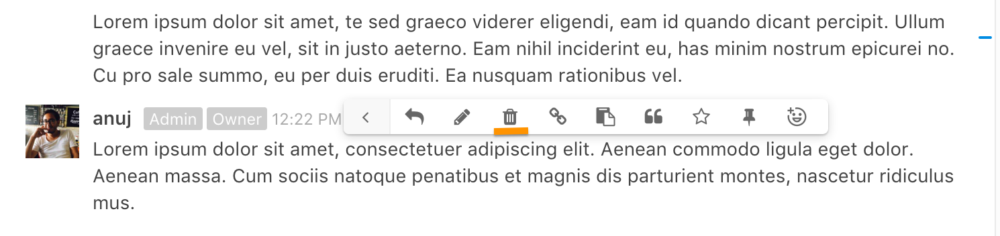

# What is Rocket chat?
Rocket.Chat is an open-source web chat platform. CloudFactory currently uses Rocket.Chat to coordinate internally among the core team and its extended workforce and externally with our clients. Clients’ presence iin Rocket.Chat is to faciliate easier communication of business and delivery needs. 

Users versed with the popular messaging platform, Slack, will find Rocket.Chat very much similar.  

# How to Download Rocket.Chat
You can connect to Rocket.Chat in one of three ways - in your browser, computer or mobile. The browser variant is compatible with all popular browsers. Desktop versions are available for Windows, Mac and Linux. Mobile variants can be downloaded from Apple’s App Store or Google’s Play Store. 

You can download Rocket.Chat here*: https://rocket.chat/download

*Windows machines have some issues managing multiple instances of Rocket.Chat. You can connect to your instance from the browser or use consolidated messaging app (such as Franz -  http://meetfranz.com/)

# Connecting to Rocket.Chat

You need to connect to the Rocket.Chat server with your user credentials to start using Rocket.Chat. The following servers are available at present:
 
 1. Client’s server: channels.cloudfactory.com 
 2. Internal server: rchat.cloudfactory.com
 3. Workforce server: workforce.cloudfactory.com

Image: Connecting to Rockethat server
 

The credentials to log into your Rocket.Chat server will be provided to you by CloudFactory in the form of an invitation. When you log in for the first time, you’ll be required to change the password provided to you in the invite
          
# Rocket.Chat Interface
Once connected to your Rocket.Chat server, your interface will look similar to the following. The examples below depict the desktop app for Mac. 

Image: Rockethat interface
 

The interface is divided into four major panels; they are listed below from left to right: 

1. Connected Servers: The leftmost panel with different icons laid vertically shows the different Rocket.Chat servers you’re connected to. To move between servers, just click on its respective icon. 

2. Channels, Groups and Direct Messages: The panel adjacent to the right shows your channels, private groups and direct messages. There are group or direct correspondence organized by different chat rooms. 

3. Chat window: The main center pane shows the actual conversation depending on the channel or group you’ve selected. 
Fly in panel: The rightmost pane, again of vertically stacked icons, are like drawers each of which houses a particular functionality like search, attachment, etc. These functionalities can be refereed to as channels operations. 

# Changing your Profile
If you want to update your profile - say fill in some details, put a cool profile picture, change your notification settings, then you can do so by going to My Accounts. 

Image: My account
 

In the Preferences tab, see above, you can customize your Rocket.Chat experience such as general layout, notification settings, etc

## Highlights
Under My Account > Preferences, there’s an option that allows you to receive an email alert every time certain keywords are mentioned. This is called Highlights. Highlighted words are searched across all conversations (channels, groups) you’re a part of. You can put multiple highlighted words, just use comma to separate. Finally, highlighted words are case insensitive. 

Image: Highlighted words in Rocket.Chat
 

# Channels
Conversations in Rocket.Chat are organized into channels. A channel can be public or private. Private channels (known as private groups) are accessible only by members invited to the room. Public channels are accessible to the entire team. Direct messages are private 1-on-1 correspondence sent to a particular recipient. 

|             |              |
|------------ | -------------| 
|   
Image: Private Groups and Channel
 |
Image: Direct Message
 |

Private groups in Rocket.Chat are conveniently prefixed with a lock icon to indicate private status. Private groups are best to share sensitive, confidential topics to a smaller subset of the team. 
Private groups can be joined by invitation only. The administrator sets the permissions that determine who can invite others to a private group. 

# Channel operations
## Favorites
To help you organize and prioritize your communications, you can favorite (or star) channels, private groups, and direct messages. To favorite a channel, click on the star icon in the upper left hand corner of the message area (next to the room name) which turns it yellow. Starring helps you to avoid noise and to focus on what’s important to you.

Image: Marking a channel as Favorite
 

Favorite channels appears under the list of Favorites in the left-hand pane, To remove as favorite, click on the star again.

## Joining channels
You can join a public channel by browsing to it and clicking on the *Join* button.

Image: Marking a channel as Favorite
  

## Hiding and leaving channels
There are two notions of leaving a channel:

1. To **hide** a channel is to remain a member of the channel but to remove it from your list of channels on the left-hand pane.

2. To **leave** a channel is to remove it from your list of channels and to leave the channel (i.e., no longer be a member of the channel).

To **leave** a channel, enter the command /part or /leave in the message window

Image:  Leaving a channel in Rocket.Chat
 

Alternatively, hover your mouse over the channel in the list of channels on the left-hand side and click on the Leave button. Similarly, clicking on the Hide button hides the channel from view. 

Image:  Hiding a channel in Rocket.Chat
 

On the mobile app, pull from the left-hand side to see the list of open channels, hold down on the channel to bring up the buttons *Leave*, *Hide* buttons.

## Messaging
Sending messages in Rocket.Chat is very straight forward. Type in the message box and press Enter (⏎) or the Send icon to post the message.

Image: Sending a message in Rocket.Chat
 

If you want to send multiple lines of text, press Shift + Enter together (⇧+⏎) to add a line break.

### Message formatting

|  Formatting                              |     Output                                                 | 
| ------------                             | -------------                                              |
| Shift + Enter                            | New line in message compose input                          | 
| * text *                                 | Bold message (Output: **text** )                           | 
|_ text _                                  | Italicize message (Output: *text*)                         |
| ~text~                                   | Strikethrough message (Output :<strike>text<strike>)                       

### Editing Messages
Rocket.Chat allows you to edit messages even after they’ve been posted. In the message box, hit the *Up Arrow* to pull the last message posted. You can also discard the message by hitting the *Down Arrow* from your keyboard. Your cursor position needs to be at the end of the message. 

|  Shortcut                                |     Description                                                | 
| ------------                             | -------------                                              |
| Up Arrow                                 | Pulls previous message in the message box. Cursor position needs to be at the beginning of the message                          | 
| Down Arrow                                 | Discards edits; cursor position needs to be at the end of the message                           | 
|Command (or Alt) + Left Arrow                         | Move to the beginning of the message |                        
| Command (or Alt) + Up Arrow                          | Move to the beginning of the message|                       
|Command (or Alt) + Right Arrow                        | Move to the end of the message      |
|Command (or Alt) + Down Arrow                         |Move to the end of the message       |

Image: Trashing a message in Rocket.Chat
 

### Notify other team members
To bring someone’s attention to a message, you can mention them. Type @ followed by their username in the message. Tagged members will be notified via email or their mobile device if they’re not online. You can also mention

|  Command                                 |     Description                                           | 
| ------------                             | -------------                                             |
| @username                                | Mention specific member in a message                      | 
| @all                                     | Mention everyone in the channel                           | 
| @here                                    | Mention everyone currently online                                               

### Replying to a message
Conversations in Rocket.Chat are not layered like in discussion boards. So Replying to messages is a good way to provide context to your recipients. To pull up the reply option, hover over the message and click on the reply option (see below)

Image:Replying to a message in Rocket.Chat 
 

The original message is indented for better readability 

Image: Message indentation in reply 
 

### Referencing Messages with Permalink
You can create a link to a message using the permalink feature in Rocket.Chat. To create a permalink, hover over the message, click on the cog icon and then the link (or chain icon). This copies the link to your clipboard. 

Image: Message indentation in reply 
 

Share the link where appropriate. Clicking on the link automatically navigates to the said message in Rocket.Chat.

### Using Commands (“/” shortcut)
The message box in the conversation pane can understand native commands. Most command-based operations can also be performed from the user interface. Commands are like shortcuts and commonly used by power users to quickly perform operations.

Image: Using commands in Rocket.Chat 
 

Here’s a list of some popular commands:

|  Command                                 |     Description                                           | 
| ------------                             | -------------                                             |
| /invite @username                               | Invites @username to the channel               | 
| /kick @username                                     | Boots @username from the channel                | 
| /leave or /part                                   | Removed user from the channel|
| /join #channel                               | Adds user to said channel               | 
| /create #channel                                    | Mention everyone in the channel                           | 
| /mute @username                                     | Mutes @username from the channel. Essentially makes them read only without ability to add messages|
| /unmute @username                                   | Unmutes said user                |                          
                                                                                                 
*Note: As more features and integrations are added to rocket.chat you might see new commands when you type “/”. Some examples would be a task board will use the command features to update or other bots which are added will use the command features to update their respective app integrations.*

### Rocket.Chat ❤ Emoji!
To insert emoji in a message, hit the emoji button to the right of the text input to view an emoji picker. You can also type your desired emoji by wrapping its name with :; for example, :heart: produces :heart:.

Image: emoji reactions 
 

 Emoji reactions allow you to respond to a message with an emoji. To respond with an emoji, hover over the message, click on the cog icon and then the emoji icon from the menu.  

* On the **mobile** application: press and hold your finger on a message to bring up a menu, press Reactions, and choose an emoji.

Then an emoji appears below the message:Using emoji in Rocket.Chat

Image: emoji reaction in a message
 
 

To remove an emoji reaction, click on the emoji below the message. To reiterate an existing emoji reaction that someone else posted, click on that emoji to add to that emoji’s counter.

## Searching Messages
The search panel in the right allows you to search for particular terms in the context of the conversation. Matching terms are listed in the search pane itself. 

Image: emoji reaction in a message
 
 

 Rocket Chat search supports the use of “regular expressions“, the benefits of which are great search flexibility and the ability to search chat entries. Regular expressions are admittedly geeky, but here are some simple yet powerful patterns that can quickly elevate your searches

| Search String        |     Output                                         | 
| ------------           | -------------                                             |
| keyword                | Returns posts with keyword. Search string is case insensitive by default              | 
| /BTW/                  | Returns capitalizes variant of the search string |            
| /BTW/i                 | Returns posts with different casing variation of BTW. The trailing i means case insensitive|
| /^BTW/i                | Returns posts with BTW anchored to the beginning of the post               | 
| /BTW$/i                | Returns posts with BTW anchored to the end of the post                        | 
| /^Any(body&#124;one)/  | Returns posts that start with “Anybody” or “Anyone” |
| /(nginx&#124;apache)/i | Returns posts with either “nginx” or “apache”  |                                             | /\s+123456\s+/i        | Returns “ 123456 “ with a space before and after |

## Attachments
There are three options available for uploading your files to a channel. You can 

* Upload an attachment by clicking on the attachment icon in the message box

* Drag and drop file directly in the conversation pane
* Copy an image in your clipboard and paste it in the message box

Attachments can be viewed by all the members in the channel. 

Image:Uploading an attachment in Rocket.Chat 
 

 

You can preview an attachment within the Rocket.Chat window or open it separately in a browser tab. Please note that you must be logged in to the Rocket.Chat server in your browser in order to view the attachment there

## Starring Messages
Starring messages is quick way to flag them in case you need to follow up on something or keep it for your reference, Starred messages appear in the right panel for easy access. 

Image: Starring message 
 

## Pinning Messages
Pinning a message is similar to starring it, but it pins it for all the members in the group. Pinning works well for group reminders

Image: Pinning a message  
 

Image: Pinned message in the conversation window  
 

To unpin a message, similar to un-starring it, pull up the Pinned Message drawer and unpin by clicking on the cog icon > unpin
  

Image: Removing a pinned message  
 

